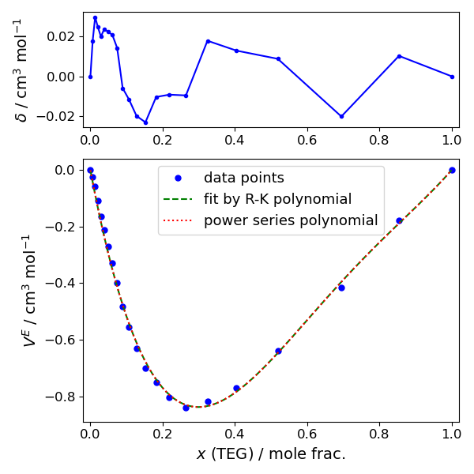

# RK-to-power-polynomials

A small library of functions useful for fitting data to Redlich-Kister (R-K) type polynomials and converting R-K polynomials to power series polynomials. 

All the functions are collected in `libPolyRK.py` library, while `example.py` presents an example of the library in use. 
The example is given for the excess volume data `rho_TEG-Wat_Guo2012.txt` taken from Ref.[^1] for the triethylene glycol+water binary mixture. 

## Requirements
**RK-to-power-polynomials** depends on `numpy` and `scipy` libraries. `Matplotlib` is used optionally for the result visualization in the example. 

## Redlich-Kister polynomials
First suggested in Ref.[^2], the polynomials appeared extremely useful for representing and parameterizing of excess properties in binary mixtures, depending on their fractional concentration (say, molar fraction $x$, varying in the range from 0 to 1). 
A typical modern presentation of R-K polynomials for description of an excess property $Y^E$ versus the fractional concentration $x$ is:

$$
Y^E = x_1 (1-x_1) \sum_{n=0}^N A_n (2 x_1 - 1)^n
$$

where $A_n$ are the R-K polynomial coefficients. 
Such representation does naturally lead to vanishing of $Y^E$ at the extremes $x_1=0$ and $x_1=1$. Here $x_1$ denotes concentration of the component '1', while the fractional concentration of the component '2' is $x_2 = 1 - x_1$. 
It results in another equivalent representation of $Y^E$ versus concentration of the second component as:

$$
Y^E = x_2 (1-x_2) \sum_{n=0}^N A_n (1 - 2 x_2)^n
$$

It is common to search for the $A_n$ coefficients by the least square regression. 
Here, it is implemented with `scipy.optimize.minimize` function by applying the 'nelder-mead' method. 

While very comfortable for the excess property description, the R-K representation is less convenient for other possible functional manipulations, such as analytic derivation. 
Therefore, in some cases, a translation to ordinary power series polynomials might be needed. 
This conversion has to provide the power series polynomial coefficients $P_n$ which satisfy equality 

$$
x_2 (1-x_2) \sum_{n=0}^N A_n (1 - 2 x_2)^n = \sum_{n=0}^{N+2} P_n x_2^n
$$

In case of a small power $N$, the coefficients $P_n$ can be found by a simple manual algebra. The **RK-to-power-polynomials** library, from the other hand, offers a general automated transformation of the polynomial of an arbitrary order $N$. 
Besides, sometimes it is useful to find the power series polynomial coefficients $P'_n$, corresponding to 'reduced'/truncated R-K polynomial, such as  

$$
\sum_{n=0}^N A_n (1 - 2 x_2)^n = \sum_{n=0}^{N} P'_n x_2^n
$$

The library offers a function for determining of $P'_n$ as well. 
Both $P_n$ and $P'_n$ coefficients are determined with use of the binomial theorem, more details can be found in Appendix to the paper[^3].

## Use case
A typical usage of the library is given in the `example.py`. 
Along with the standard libraries, the present one is imported by 
```python
import libPolyRK as rk
```
After loading and plotting the original numeric data, the R-K coefficients $A$ are determined by 
```python
A = rk.polyfitRK(xdata, ydata, n)
```
where $n$ is the desired number of coefficients. 
In the vector $A$ the coefficients are ranged from 0-th to $(n-1)$-th order, i.e., $A_i = A[i].$ 
When a property $Y$ to be found from the coefficients $A$, 
```python
Y = rk.polyvalRK(A, xdata)
```

To translate the $A$ coefficients into the vector of full power series coefficients $P$, use 
```python
P = rk.polyConvRK2power(A)
```
If, occasionally, a conversion of truncated R-K polynomial is needed, corresponding polynomial coefficients $P'$ can be found by 
```python
P_prime = rk.polyConvRK2powerReduc(A)
```

The example presents fitting the original data to R-K polynomial of 3-rd order, and finding the equivalent power series polynomial coefficients of 5-th order. 
Then, the identity of both polynomial representations is evidenced in the plotted figure: 




## References
[^1]: Guo, Z. et al. (2012) ‘Liquid viscosities, excess properties, and viscous flow thermodynamics of triethylene glycol+water mixtures at T=(298.15, 303.15, 308.15, 313.15, and 318.15) K’, Journal of Molecular Liquids, 165, pp. 27–31. Available at: https://doi.org/10.1016/j.molliq.2011.10.003.
[^2]: Redlich, O. and Kister, A.T. (1948) ‘Algebraic Representation of Thermodynamic Properties and the Classification of Solutions’, Industrial & Engineering Chemistry, 40(2), pp. 345–348. Available at: https://doi.org/10.1021/ie50458a036.
[^3]: Santos, C.I.A.V. et al. (2022) ‘Transport properties of n-ethylene glycol aqueous solutions with focus on triethylene glycol–water’, The Journal of Chemical Physics, 156(21), p. 214501. Available at: https://doi.org/10.1063/5.0091902.
